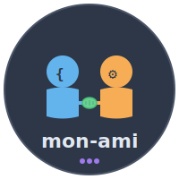

# Mon-Ami 

mon-ami is my personal toolkit for working with Claude Code — a growing set of plugins, commands, and skills I use to augment coding, reasoning, and agent workflows.

Everything here is shaped by day-to-day use, focusing on clarity, reuse, and composability. It extends Claude Code with practical skills and commands, tuned for how I actually work.

## Plugins

### mon

**My** pragmatic engineering principles: YAGNI, SOLID, KISS, DRY, fail fast, and more.

**Skill:** `mon:development-principles`
- Invoke when designing, implementing, or reviewing code
- Covers: YAGNI, Composability, SOLID, DRY, KISS, Separation of Concerns, Fail Fast, Error Handling, Testing, Performance, Security, Code Review, Refactoring, Problem-Solving, Communication Style, PR Authoring

**Commands:**
- `/mon:review` - Reviews recent code changes against the principles; reports findings with file paths and line numbers
- `/mon:improve` - Systematic code quality, performance, and maintainability improvements
- `/mon:research` - Deep web research with adaptive planning and evidence-based synthesis
- `/mon:business-panel` - Multi-expert business analysis using renowned thought leader frameworks

### ami

Utility commands and skills for Claude Code itself, **my friend**.

**Skill:** `ami:confidence-check`
- Pre-implementation confidence assessment (≥90% required)
- Verifies: no duplicates, architecture compliance, official docs, OSS references, root cause

**Command:** `/ami:skills`
- Lists all available skills in a table format

**Command:** `/ami:prune`
- Audits and cleans up plugin installation
- Identifies orphaned caches, old versions, manifest drift

## Installation

Add the marketplace, then install plugins:

```shell
/plugin marketplace add christophercampbell/mon-ami
```

```shell
/plugin install mon@mon-ami
```

```shell
/plugin install ami@mon-ami
```

Or use `/plugin` to browse and install interactively.

## License

MIT
